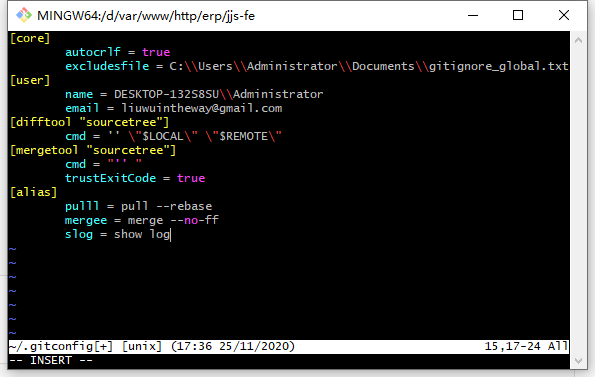

#常用命令

## 使用注意点
- 不该 在公共分支上做强推，对 push --force 要有所敬畏。强烈建议不要使用.
- 不该 将代码格式化和功能代码修改放在一次 commit 中。
- 如果对rebase不太了解,谨慎使用.总的原则是，只对尚未推送或分享给别人的本地修改执行rebase，从不对已推送的提交执行。

多种类型的修改放在一次 commit 中，不利于后续的代码 review 和他人理解，最好分开多次提交。例如某次修改发现代码格式有问题要格式化，可先做一次提交，仅对代码进行格式化，后续的功能修改，再单独做提交。

## git提交代码
举例:你想在feature/zoro/gitbook_serve分支上完成你的代码,并将它提交到develop上.
执行过程:
1. 拉取远程develop分支的最新代码
```
git checkout develop
git pull --rebase
 ```
2. 新建功能分支并切换到该功能分支
```
git branch feature/zoro/gitbook_serve
git checkout feature/zoro/gitbook_serve
//也可以直接使用命令
git checkout -b feature/zoro/gitbook_serve
```
3. Happy Code,完成功能,提交修改;(也可以使用图形化软件,比如sourceTree)
```
git add file1.php file2.html
//或者直接使用
git add .
git commit -m 'input commit log'
// 如果需要推到远程测试
git push origin feature/zoro/gitbook_serve
```
4. 合并提交
```
// 先把develop分支和功能分支拉到最新，再合并提交
git checkout develop
git pull --rebase
git checkout feature/zoro/gitbook_serve
git rebase develop
git checkout develop
git merge --no-ff feature/zoro/gitbook_serve
git push
```

## tips
- 简便命令的方法-使用别名
```
$ vim ~/.gitconfig
// 增加alias选项,我就加了三个别名
[alias]
    pulll = pull --rebase
    mergee = merge --no-ff
    slog = show log
```

