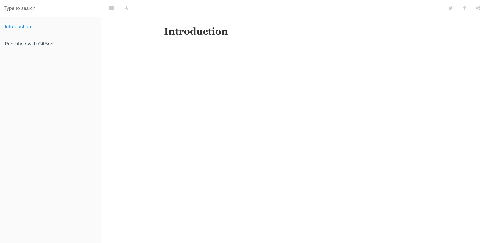

#搭建过程

## gitbook简介
- [GitBook 官网](https://www.gitbook.com/)
- [GitBook 文档](https://github.com/GitbookIO/gitbook)

## 安装node
```
$ sudo apt-get install nodejs
$ sudo apt-get install npm
$ node -v
 ```

## 安装gitbook
```
$ npm install gitbook-cli -g
 ```
安装完成后,检验是否安装成功
```
$ gitbook -V
CLI version: 2.3.2
GitBook version: 3.2.3
```
>更多详情请参照 [GitBook 安装文档](https://github.com/GitbookIO/gitbook/blob/master/docs/setup.md) 来安装 GitBook。

## 新建项目
GitBook 准备工作做好之后，我们进入一个你要写书的目录，输入如下命令。
```
$ gitbook init
warn: no summary file in this book
info: create README.md
info: create SUMMARY.md
info: initialization is finished
```

可以看到他会创建 README.md 和 SUMMARY.md 这两个文件，README.md 应该不陌生，就是说明文档，而 SUMMARY.md 其实就是书的章节目录，其默认内容如下所示：
```
# Summary

* [Introduction](README.md)
```

接下来，我们输入 ```$ gitbook serve``` 命令，然后在浏览器地址栏中输入 ```http://localhost:4000``` 就可以预览啦.
我用的虚拟机,是在windows访问虚拟机地址 ```192.168.33.10:4000``` 预览的,使用虚拟机的小伙伴把IP换成自己的虚拟机IP就可以啦

效果图如下



## 目录结构
GitBook 基本的目录结构如下所示：
```
.
├── book.json
├── README.md
├── SUMMARY.md
├── chapter-1/
|   ├── README.md
|   └── something.md
└── chapter-2/
    ├── README.md
    └── something.md
```

book.json是配置文件,```gitbook init```时可能不会创建,可以手动新建.

我的初始配置
```
{
	"title": "my book",
	"description": "我的gitbook文档",
    "author": "zoro",
	"language": "zh-hans",
	"gitbook": "3.2.3",
	"plugins": [
   		"tbfed-pagefooter@^0.0.1",
   		"splitter@^0.0.8"
	],
	"pluginsConfig": {
    	"tbfed-pagefooter": {
        	"copyright":"Copyright &copy www.qlight.site 2020",
        	"modify_label": "Modified at ",
        	"modify_format": "YYYY-MM-DD HH:mm:ss"
    	}
}	
}

```