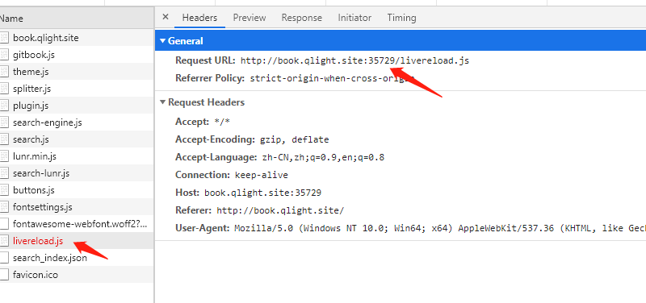

# 部署到服务器

## gitbook简介
- [我的gitbook地址](http://book.qlight.site/)


## 遇到的问题
- Gitbook站点图标需要很久才能显示出来.
图标一直转圈圈,F12看network看到是访问35729端口的livereload.js访问失败


问题是服务器的35729端口没开放，访问超时了.
解决方案有二:
1. 禁用livereload;livereload是一款能根据你本地文件(html、css、js)的变化，自动跟踪刷新浏览器的实时刷新工具。
我们的gitbook都是本地写好测好发布到服务器的，不需要livereload.禁用方式是在book.json里的plugins加一行```"-livereload"```
```json
{
    "plugins": [
        "-livereload"
    ]
}
```
2. 开放服务器的35729端口,我没实测,小伙伴们可以试试.
